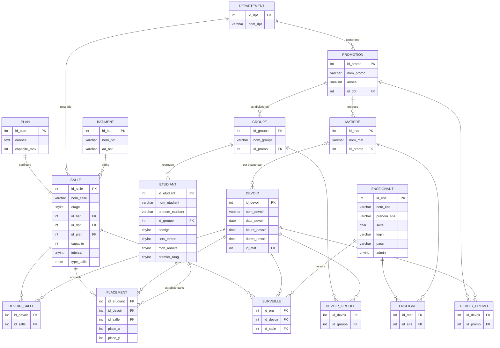

```mermaid
erDiagram

    BATIMENT {
        int      id_bat   PK
        varchar  nom_bat
        varchar  ad_bat
    }

    DEPARTEMENT {
        int      id_dpt   PK
        varchar  nom_dpt
    }

    PLAN {
        int      id_plan       PK
        text     donnee
        int      capacite_max
    }

    SALLE {
        int      id_salle   PK
        varchar  nom_salle
        tinyint  etage
        int      id_bat     FK
        int      id_dpt     FK
        int      id_plan    FK
        int      capacite
        tinyint  intercal
        enum     type_salle
    }

    PROMOTION {
        int       id_promo   PK
        varchar   nom_promo
        smallint  annee
        int       id_dpt     FK
    }

    GROUPE {
        int      id_groupe   PK
        varchar  nom_groupe
        int      id_promo    FK
    }

    MATIERE {
        int      id_mat    PK
        varchar  nom_mat
        int      id_promo  FK
    }

    ENSEIGNANT {
        int      id_ens      PK
        varchar  nom_ens
        varchar  prenom_ens
        char     sexe
        varchar  login
        varchar  pass
        tinyint  admin
    }

    ETUDIANT {
        int      id_etudiant     PK
        varchar  nom_etudiant
        varchar  prenom_etudiant
        int      id_groupe       FK
        tinyint  demigr
        tinyint  tiers_temps
        tinyint  mob_reduite
        tinyint  premier_rang
    }

    DEVOIR {
        int      id_devoir    PK
        varchar  nom_devoir
        date     date_devoir
        time     heure_devoir
        time     duree_devoir
        int      id_mat       FK
    }

    ENSEIGNE {
        int  id_mat  FK
        int  id_ens  FK
    }

    DEVOIR_GROUPE {
        int  id_devoir  FK
        int  id_groupe  FK
    }

    DEVOIR_PROMO {
        int  id_devoir  FK
        int  id_promo   FK
    }

    DEVOIR_SALLE {
        int  id_devoir  FK
        int  id_salle   FK
    }

    PLACEMENT {
        int  id_etudiant  FK
        int  id_devoir    FK
        int  id_salle     FK
        int  place_x
        int  place_y
    }

    SURVEILLE {
        int  id_ens     FK
        int  id_devoir  FK
        int  id_salle   FK
    }

    BATIMENT      ||--o{  SALLE          : "abrite"
    DEPARTEMENT   ||--o{  SALLE          : "possède"
    DEPARTEMENT   ||--o{  PROMOTION      : "comprend"
    PLAN          ||--||  SALLE          : "configure"
    PROMOTION     ||--o{  GROUPE         : "est divisée en"
    PROMOTION     ||--o{  MATIERE        : "propose"
    GROUPE        ||--o{  ETUDIANT       : "regroupe"
    MATIERE       |o--o{  DEVOIR         : "est évalué par"
    MATIERE       ||--o{  ENSEIGNE       : ""
    ENSEIGNANT    ||--o{  ENSEIGNE       : ""
    DEVOIR        ||--o{  DEVOIR_GROUPE  : ""
    GROUPE        ||--o{  DEVOIR_GROUPE  : ""
    DEVOIR        ||--o{  DEVOIR_PROMO   : ""
    PROMOTION     ||--o{  DEVOIR_PROMO   : ""
    DEVOIR        ||--o{  DEVOIR_SALLE   : ""
    SALLE         ||--o{  DEVOIR_SALLE   : ""
    ETUDIANT      ||--o{  PLACEMENT      : "est placé dans"
    DEVOIR        ||--o{  PLACEMENT      : "génère"
    SALLE         ||--o{  PLACEMENT      : "accueille"
    ENSEIGNANT    ||--o{  SURVEILLE      : "assure"
    DEVOIR        ||--o{  SURVEILLE      : ""
    SALLE         ||--o{  SURVEILLE      : ""
```